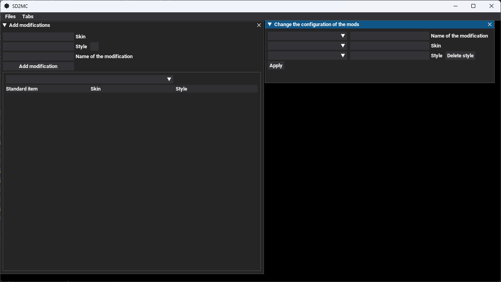

Logo for window was taken from [UI icons from Dragon Icons](https://www.flaticon.com/ru/free-icons/ui)

For interface used library [dearpygui](https://github.com/hoffstadt/DearPyGui)

Guide languages [Russian](../../README.md) [English](Readme.eng.md)
# Install requirements
1. The program creates mods for launcher [MOR](https://vk.com/amir4anmods). Enter the group, open the dialogue and press "Скачать MOR".
2. Now download the program, press code -> "download zip", unpack this.
3. Now you need to download [python](https://python.org/download).
   - Don't forget to enable Add python.exe to PATH flag

   
   
   - If there is Disable path length limit in the end of installation, press this button.
# Using of program

1. To start the program use start.bat
2. After start program you will see 2 open tabs "add modifications" and "Change the configuration of the mods"
3. You can add modification in the tab with similar name.
   - For this input skin and mod name in the fields. If you need the style, enable the flag and input the number of style in the field.
   - There is a table below. Choose the modification in Drop-down list. You can see modification information in the table
4. In the tab "Configuration of the modifications" you can correct faults.
   - Choose mod name in drop-down list, than items. Write right names in the field to the right from drop-down lists. 
6. You can also save mod configuration. For this open "Files" -> "Save configuration of modifications"/"Load configuration of modifications"
7. To show closed tabs use "Tabs".
   - You can also save tabs place and size "Tabs" -> "Save tabs configuration".
8. If you need to change dota path or language, use "Files -> "Settings"
